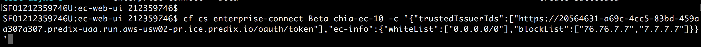
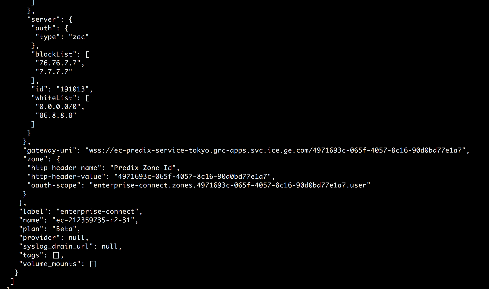
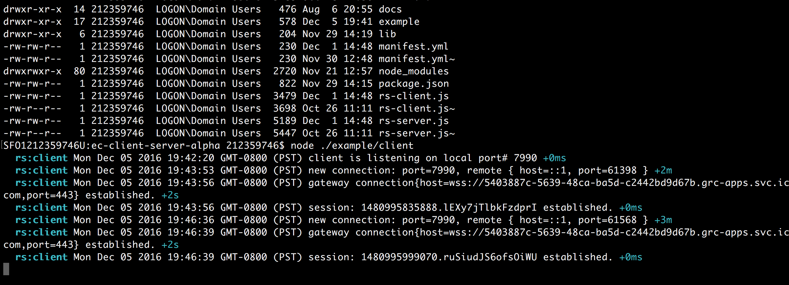
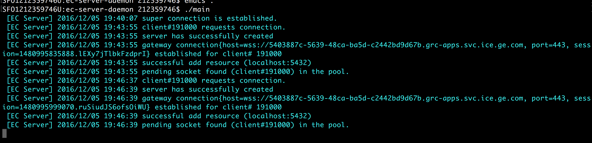
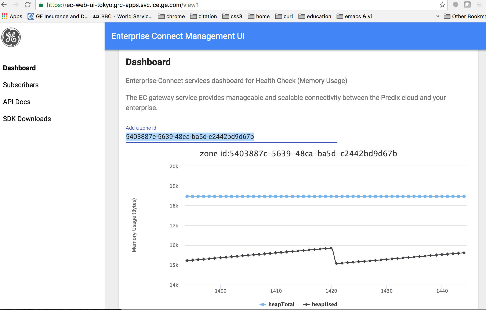
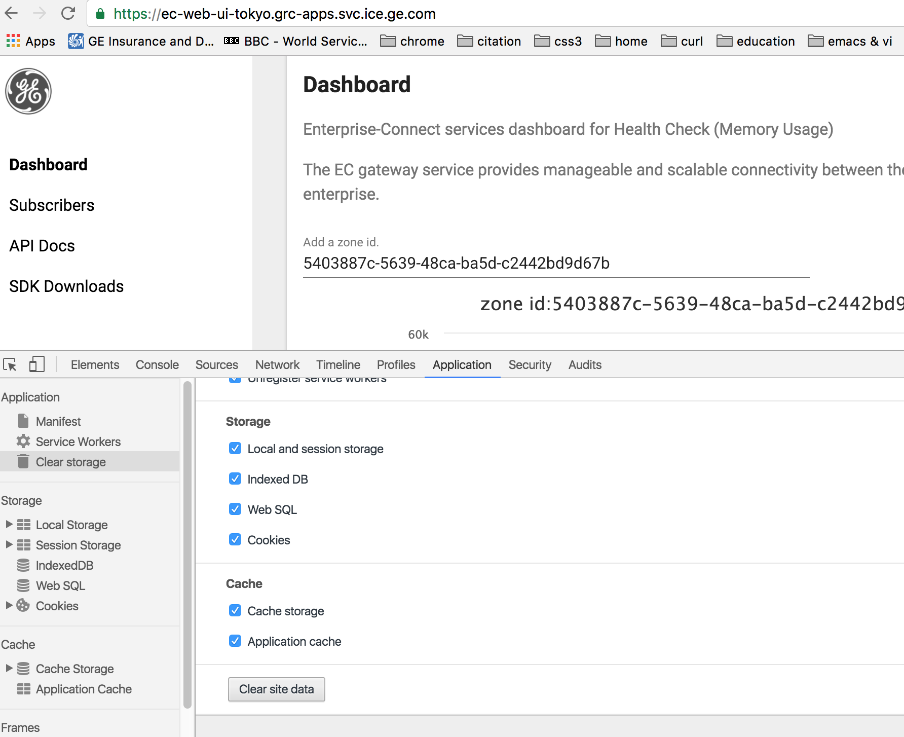
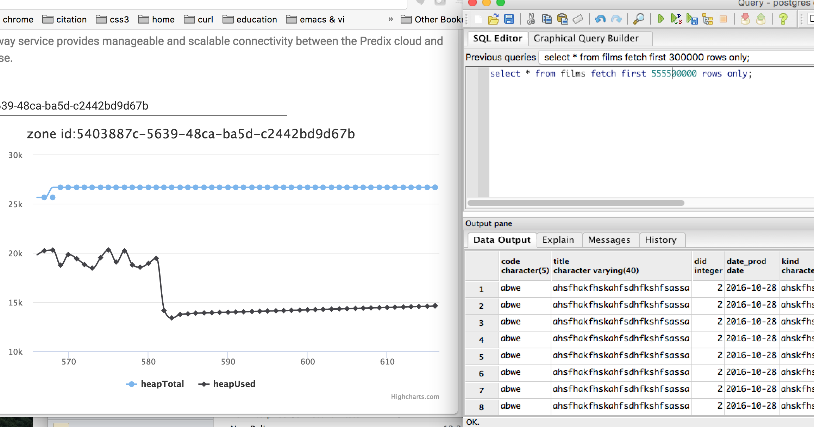

# Enterprise-Connect Web UI
Environment | Build Status
--- | ---
[Predix R2](https://ec-web-ui-tokyo.grc-apps.svc.ice.ge.com) | 
[Predix Basic](https://ec-web-ui-osaka.run.aws-usw02-pr.ice.predix.io) | 
[Predix Select](https://ec-web-ui-nara.run.asv-pr.ice.predix.io) | 

## Usage
1. Deploy an EC gateway in a supported environment. (R2/Basic/Select)

2. Get the gateway's credential from VCAP_SERVICE

3. Update EC Client/Server settings.json
4. Run EC Client/Server.

5. Open up a brower (tested in Chrome) and point the URL to one of the EC Web UI instances by clicking on the above environment link in this repo.

6. Before the usage, make sure the browser cache is clear.

7. Type in a zone id for the service in the selected environment (R2/Basic/Select) and press enter.
8. Begin data exchange and see the memory usage in the gateway in realtime.

##Sample Screenshots

